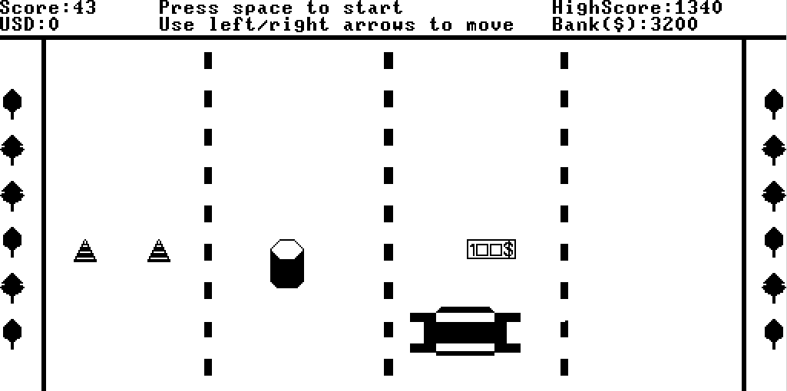

# 🚗💨 Traffic Racer Game in Jack Language

This project is an implementation of a **Traffic Racer** game 🛣️ using the **Jack programming language**. The game is designed to run on the **Nand2Tetris platform** 🖥️.

---

>## ⚠️ Disclaimer

>This project is created **purely for educational purposes** as part of the Nand2Tetris course.  
>It is **not affiliated with or related to the official Traffic Racer game** or its creators.

---

## 📂 Project Structure

| 🗂️ **File**               | 🛠️ **Description**                                                                                                            |
|---------------------------|-----------------------------------------------------------------------------------------------------------------------------|
| `Main.jack`               | 🎬 Acts as the game's entry point, managing high-level execution.                                                             |
| `TrafficRacesGame.jack`   | 🕹️ Central game engine: manages the main loop, synchronizes gameplay events, handles visual updates.                         |
| `GameSetup.jack`          | 🛠️ Prepares and visually sets up the game environment before gameplay begins.                                                |
| `ScoreBoard.jack`         | 📈 Tracks & displays the player’s score dynamically; updates high scores to preserve progress.                                |
| `Falied.jack`             | 💀 Manages the game-over state and offers restart/quit functionality.                                                         |
| `Random.jack`             | 🎲 Adds randomness by generating varied obstacle & collectible positions.                                                    |
| `Car.jack`                | 🚗 Handles player-controlled car movement.                                                                                   |
| `Dollar.jack`             | 💵 Manages collectible dollar behavior & scoring logic.                                                                       |
| `Barrel.jack`             | 🛢️ Implements barrel obstacle behavior.                                                                                       |
| `Cone.jack`               | 🚧 Implements cone obstacle behavior.                                                                                        |
| `Tree1.jack` & `Tree2.jack` | 🌳 Animates tree visuals for added environment detail.                                                                      |

---

## ▶️ How to Run

1. **Clone the repository:**
    ```sh
    git clone https://github.com/amitfld/Traffic-Racer-Game.git
    cd Traffic-Racer-Game
    ```

2. **Compile the Jack files:**
    - Open the [Jack Compiler](https://nand2tetris.github.io/web-ide/compiler)
    - Load the folder containing all `.jack` files
    - Click **Compile**
    - Once compiled, click **Run**

3. **Start the game:**
    - Set *Execution Speed* to **Fast** ⚡
    - Click `>>` (Run)
    - Click **Enable Keyboard**
    - 🎮 Start playing!

---

## 🕹️ Game Instructions

1. 🚀 Press the **spacebar** to start the game.
2. ⬅️➡️ Use the **arrow keys** to move the car, avoid obstacles, and collect dollars.
3. 💥 The game ends when you hit an obstacle (cone or barrel). A **Game Over** screen will appear.
4. 🔁 Press **R** to restart (keeping high score & collected money).  
   ❌ Press **Q** to quit.

---

## 🎥 Game Demo

[](https://drive.google.com/file/d/1g42hettqR6rmlcHG4pEhDaiUul0Gw2mb/view?usp=drive_link)

👉 **Watch the full demo [here](https://drive.google.com/file/d/1jfF3s7Ixz-eheqHtRInSOSUI5TwAaScC/view?usp=sharing)**

---

## 👥 Authors

- Amit Feldman
  
  GitHub: [@amitfld](https://github.com/amitfld)

  LinkdIn: [Amit Feldman](https://www.linkedin.com/in/amit-fld/)

- Yotam Markman

---

## 📝 License

This project is licensed under the MIT License. See the [LICENSE](https://github.com/amitfld/Traffic-Racer-Game/blob/main/LICENSE) file for full details.
